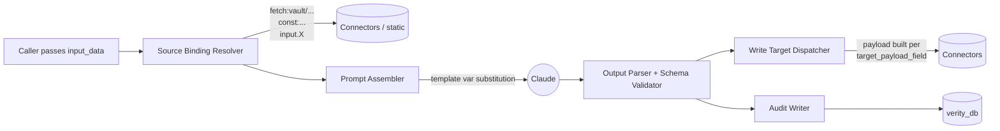
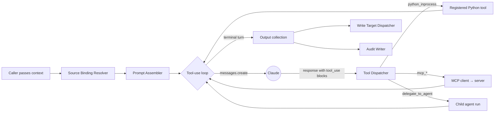

# Verity Application Developer Guide

This is the single reference for building a business application that runs on top of Verity. It covers three things:

1. **Anatomy** — what an Agent and a Task actually look like (input, internals, output, audit)
2. **Composition Handbook** — how to register applications, agents, tasks, prompts, tools, connectors, and wiring
3. **Orchestration & Invocation** — how to call Verity, thread workflow correlation IDs, work with channels, mock for development, and handle errors

Read top-to-bottom for a full picture; jump to the section you need by topic.

> **Companion docs.** This guide stays at the API/contract level. For the full system internals see [`architecture/technical-design.md`](../architecture/technical-design.md). For the I/O grammar in depth see [`architecture/execution.md`](../architecture/execution.md). For a worked walkthrough see [`example-end-to-end.md`](../example-end-to-end.md).

> **Glossary.** Unfamiliar terms (Source Binder, Write Target, Reference Grammar, Channel, …) are defined in [`glossary/`](../glossary/README.md). This document uses link-only references on first use; the [`example-end-to-end.md`](../example-end-to-end.md) walkthrough uses tooltip-on-hover via `<abbr>` for the same terms.

---

## Table of Contents

### Anatomy of Verity AI Entities — Tasks and Agents
- [Task vs Agent — pick which](#task-vs-agent--pick-which)
- [Anatomy of a Task](#anatomy-of-a-task)
  - [What goes in](#what-goes-in)
  - [What happens inside](#what-happens-inside)
  - [What comes out](#what-comes-out)
- [Anatomy of an Agent](#anatomy-of-an-agent)

### Composition Handbook
- [2.1 Register an Application](#21-register-an-application)
- [2.2 Register an Inference Config](#22-register-an-inference-config)
- [2.3 Register a Prompt](#23-register-a-prompt)
- [2.4 Register Tools](#24-register-tools) — Python in-process · MCP-served · authorization · Connector vs MCP
- [2.5 Register a Data Connector](#25-register-a-data-connector)
- [2.6 Register an Agent or a Task](#26-register-an-agent-or-a-task) — entity · version · field guidance
- [2.7 Compose Source Bindings (declarative input I/O)](#27-compose-source-bindings-declarative-input-io) — reference grammar · binding kinds
- [2.8 Compose Write Targets (declarative output I/O)](#28-compose-write-targets-declarative-output-io) — payload fields · channel gating
- [2.9 Authorize Sub-Agent Delegations](#29-authorize-sub-agent-delegations)
- [2.10 Promote Through the Lifecycle](#210-promote-through-the-lifecycle)

### Orchestration & Invocation
- [3.1 The two synchronous entry points](#31-the-two-synchronous-entry-points) — `execute_task` / `execute_agent`
- [3.2 Asynchronous submission (the worker pattern)](#32-asynchronous-submission-the-worker-pattern) — `submit_task` / `submit_agent`
- [3.3 Multi-step workflows — the `workflow_run_id` pattern](#33-multi-step-workflows--the-workflow_run_id-pattern)
- [3.4 Sub-agent delegation — what the parent has to do](#34-sub-agent-delegation--what-the-parent-has-to-do)
- [3.5 Channels and write modes](#35-channels-and-write-modes)
- [3.6 Run purpose](#36-run-purpose)
- [3.7 Mock mode for development & tests](#37-mock-mode-for-development--tests)
- [3.8 Error surfaces](#38-error-surfaces)
- [3.9 When to use sync vs async](#39-when-to-use-sync-vs-async)
- [Appendix — common patterns](#appendix--common-patterns)
- [Where to next](#where-to-next)

> **Audience-routed reading paths.**
> *New to Verity:* read top-to-bottom.
> *Just need to register an entity:* jump to [§ 2.6](#26-register-an-agent-or-a-task), then [§ 2.7](#27-compose-source-bindings-declarative-input-io) + [§ 2.8](#28-compose-write-targets-declarative-output-io).
> *Just need to invoke from app code:* jump to [§ 3.1](#31-the-two-synchronous-entry-points), then [§ 3.3](#33-multi-step-workflows--the-workflow_run_id-pattern).
> *Debugging mocks / errors:* [§ 3.7](#37-mock-mode-for-development--tests) + [§ 3.8](#38-error-surfaces).

---

# Anatomy of Verity AI Entities - Tasks and Agents

Verity has exactly two execution units: **Task** and **Agent**. Everything else (Pipelines, multi-step workflows) is orchestrated by your application code on top of these two primitives.

## Task vs Agent — pick which

| | **Task** | **Agent** |
|---|---|---|
| Pattern | One LLM call, structured output | Multi-turn loop with tool use |
| Output | Validated against `output_schema` | Free-form, optionally enforced via `submit_output` |
| Tools | None (use a Task to call out without LLM-in-the-loop reasoning) | Yes, authorized per agent version |
| Sub-agents | No | Yes, via `delegate_to_agent` meta-tool |
| Use when | Classification, extraction, summarization, scoring — anything single-shot with a clear input → structured output mapping | Multi-step reasoning, tool-driven exploration, judgement that needs context-gathering |
| Cost / latency | Lower; predictable | Higher; bounded by tool budget and turn cap |
| Example | `document_classifier` (one PDF in, document_type out) | `triage_agent` (looks up loss history, enrichment, prior submissions, then scores) |

Default to Task. Reach for Agent only when the work genuinely needs the loop.

## Anatomy of a Task



### What goes in

1. **`input_data`** — the dict your code passes. Validated against the task version's `input_schema` at runtime. Missing required fields raise `InputSchemaError` before any LLM call.
2. **Resolved source bindings** — for every row in `source_binding` for this task version, the resolver fetches data:
   - `binding_kind = 'text'` — fetched value is bound to a template variable like `{{document_text}}` and substituted into the prompt
   - `binding_kind = 'content_blocks'` — fetched value is a list of Claude content blocks (image, document) prepended to the first user message. This is how Vault PDFs reach Claude as vision input.
3. **Resolved configuration** — pinned prompt versions, inference config (model, temperature, max_tokens). Frozen at the moment the task version was promoted; cannot drift at runtime.

### What happens inside

1. **Prompt assembly** — system prompt + user prompt(s) are loaded by version, template variables substituted, conditional sections evaluated against `governance_tier`. Missing-variable errors are raised at execution time (no silent placeholder).
2. **LLM call** — one `messages.create()` to Anthropic with the assembled prompt, no tools. Extended thinking is on if the inference config sets it.
3. **Output parsing** — the LLM's text response is parsed (typically JSON) and **validated against `output_schema`**. A schema violation is a hard failure; no silent coercion.

### What comes out

| Stream | Where it lands |
|---|---|
| Structured `output` JSON | Returned to caller in `ExecutionResult.output` |
| `source_resolutions` audit | Stored inline in the `agent_decision_log` row — one entry per binding, with status, payload size, fetch identifier |
| `target_writes` audit | Stored inline in the `agent_decision_log` row — one entry per target, with mode, mode_reason, status, handle |
| `decision_log` row | One row in `agent_decision_log`, immutable |
| `model_invocation_log` row | One row per LLM call (one for a Task) |
| `execution_run` lifecycle | One row in `execution_run`; lifecycle events in `execution_run_status` |

## Anatomy of an Agent

Agents extend Task anatomy with the tool loop and sub-agent delegation.



Differences vs. Task:

- **Tool authorization** — every tool call checks `agent_version_tool` for `(agent_version_id, tool_name)`. Unauthorized → call rejected and Claude is informed; the loop continues so Claude can correct itself.
- **Tool transports**:
  - `python_inprocess` — a Python callable registered via `verity.register_tool_implementation(name, func)`
  - `mcp_*` — dispatched via the MCP client to a registered MCP server
- **Sub-agent delegation** — `delegate_to_agent` is a built-in meta-tool. Authorization checked against `agent_version_delegation`. The child agent's `parent_decision_id` and `decision_depth` are set automatically; the parent's audit row references the child decision.
- **Output handling** — by default the agent emits free-form text and `output` is best-effort-parsed. Set `enforce_output_schema=True` and the runtime injects a synthetic `submit_output` tool whose schema is the agent's `output_schema` and forces `tool_choice` on the terminal turn — output becomes structurally guaranteed.
- **Multiple `model_invocation_log` rows** — one per turn (often 3–8 per agent run). The `decision_log` row aggregates them with `tool_calls_made`.

---

# Composition Handbook

This part walks through registering each kind of governed entity, in roughly the order you'd build a new application.

## 2.1 Register an Application

Every consuming app has exactly one `application` row. All entities and decisions tie back to it.

```python
app = await verity.register_application(
    name="uw_demo",
    display_name="Underwriting Demo",
    description="Reference D&O underwriting application",
)
```

Map every entity (agent / task / prompt / tool / pipeline) you'll use to this application via `application_entity` rows. The mapping is many-to-many — entities can be shared across applications. Verity governs which app sees which entity by mapping membership.

## 2.2 Register an Inference Config

Reusable LLM API parameter sets. Promote one for stable use across multiple entities.

```python
cfg = await verity.register_inference_config(
    name="extraction_default",
    display_name="Extraction — deterministic",
    model_id="claude-sonnet-4-6",
    temperature=0.0,
    max_tokens=4096,
    extended_params={
        # optional — see enhancements/rate-limit-retry-backoff.md
        # "retry": {"max_attempts": 3, "backoff_ms": [1000, 2000, 4000]},
    },
)
```

A new inference config is its own version; once any agent or task version pins this config, it is **frozen** for that entity version (composition immutability — see [`enhancements/tool-versioning.md`](../enhancements/tool-versioning.md) for the analogous gap on tools).

## 2.3 Register a Prompt

Prompts have independent versioning. A prompt version carries the template text plus governance metadata.

```python
prompt = await verity.register_prompt(
    name="document_classifier_system",
    display_name="Document Classifier — System",
    description="System prompt for the document classifier task",
)

pv = await verity.register_prompt_version(
    prompt_name="document_classifier_system",
    template="""You are a document classifier for commercial insurance submissions.
Classify the attached document as one of: do_application, gl_application, loss_run, board_resolution, financial_statement, other.


Pay special attention to subtle indicators of materiality.


Respond with JSON: {"document_type": "...", "subtype": "...", "confidence": 0.0-1.0}.
""",
    governance_tier="standard",   # or "high" — gates conditional sections
    change_summary="Initial version",
)
```

Template variables (`{{document_text}}`, etc.) are bound at execution time from resolved source bindings. Conditional Jinja sections key off `governance_tier`.

## 2.4 Register Tools

Tools have one row per tool, with a `transport` discriminator.

### Python in-process tool

```python
# Register the metadata
tool = await verity.register_tool(
    name="loss_history_lookup",
    display_name="Loss history lookup",
    description="Returns the 5-year loss history for a named insured.",
    transport="python_inprocess",
    input_schema={
        "type": "object",
        "properties": {"insured_name": {"type": "string"}},
        "required": ["insured_name"],
    },
    output_schema={
        "type": "object",
        "properties": {
            "claims": {"type": "array", "items": {"type": "object"}},
            "total_incurred": {"type": "number"},
        },
    },
    is_write_operation=False,
    requires_confirmation=False,
    data_classification_max="internal",
)

# Register the Python implementation (must be done by app at startup)
async def loss_history_lookup_impl(insured_name: str) -> dict:
    rows = await pas_db.fetch_all(
        "SELECT * FROM claim WHERE insured_name = $1 AND date >= NOW() - INTERVAL '5 years'",
        insured_name,
    )
    return {"claims": [dict(r) for r in rows],
            "total_incurred": sum(r["incurred"] for r in rows)}

verity.register_tool_implementation("loss_history_lookup", loss_history_lookup_impl)
```

### MCP-served tool

The tool row points at an `mcp_server` row; the runtime forwards calls through the MCP client.

```python
mcp = await verity.register_mcp_server(
    name="enrichment_mcp",
    transport="stdio",                # or "sse" for HTTP-served
    command="python -m enrichment_mcp_server",
    description="LexisNexis + D&B enrichment via MCP",
)

await verity.register_tool(
    name="get_dnb_financials",
    display_name="D&B Financials lookup",
    description="...",
    transport="mcp_stdio",
    mcp_server_name="enrichment_mcp",
    input_schema={...},
    output_schema={...},
)
```

Authorize the tool on a specific agent version (composition step):

```python
await verity.authorize_agent_tool(
    agent_version_id=av.id,
    tool_id=tool.id,
    requires_confirmation=False,
    write_mode_allowed="auto",
)
```

> **Connector vs MCP — common confusion.** A *Connector* (`data_connector`) resolves declared **data I/O** before / after the LLM call (source bindings and write targets). An *MCP server* is a **transport for tools** that the agent decides to call mid-loop. Vault is a Connector. An external API surfaced as an MCP server is a Tool transport. They are orthogonal — see [`architecture/execution.md`](../architecture/execution.md).

## 2.5 Register a Data Connector

Connectors are integrations that provide `fetch_method`s (used by source bindings) and `write_method`s (used by write targets). The `data_connector` row stores the name and non-secret tuning config; the actual provider is registered in Python by the app.

```python
# 1. Register the connector metadata in the Verity DB
await verity.register_data_connector(
    name="vault",
    display_name="Vault — document store",
    fetch_methods=["get_document_text", "get_document_content_blocks", "list_documents"],
    write_methods=["create_document", "create_derived_json"],
    config={"base_url_env": "VAULT_URL"},
)

# 2. Register the provider implementation in the runtime
from verity.runtime.connectors import register_connector_provider
from vault_client import VaultConnectorProvider

register_connector_provider("vault", VaultConnectorProvider())
```

The provider implements two contracts:

```python
class ConnectorProvider:
    async def fetch(self, method: str, ref: Any) -> Any: ...
    async def write(self, method: str, container: Any, payload: Any) -> dict: ...
```

Verity itself does not import Vault (or any other connector). The package stays connector-agnostic; consuming apps register what they need.

## 2.6 Register an Agent or a Task

The entity row is a name + metadata. The version row is the frozen composition.

```python
# Entity
agent = await verity.register_agent(
    name="triage_agent",
    display_name="Submission Triage Agent",
    description="Scores a submission and routes it to the right underwriter.",
    materiality_tier="high",
    capability_type="judgment",
    trust_level="supervised",
    data_classification_max="confidential",
    owner_email="uw_governance@example.com",
)

# Version
av = await verity.register_agent_version(
    agent_name="triage_agent",
    version_label="2.1.0",
    inference_config_name="reasoning_default",
    input_schema={
        "type": "object",
        "properties": {
            "submission_id": {"type": "string"},
            "named_insured": {"type": "string"},
            "extracted_fields": {"type": "object"},
        },
        "required": ["submission_id", "named_insured"],
    },
    output_schema={
        "type": "object",
        "properties": {
            "risk_score": {"type": "integer", "minimum": 0, "maximum": 100},
            "routing": {"enum": ["junior_underwriter", "senior_underwriter", "executive_review"]},
            "narrative": {"type": "string"},
            "risk_factors": {"type": "array", "items": {"type": "string"}},
        },
        "required": ["risk_score", "routing"],
    },
    change_summary="Initial triage agent version",
)
```

Tasks register with `register_task` / `register_task_version` — same shape, no tool authorization step.

### Field guidance

| Field | When to pick which value |
|---|---|
| `materiality_tier` | `low` for cosmetic / advisory; `medium` for routing/scoring; `high` for anything affecting customer-facing decisions or money. Drives gate strictness. |
| `capability_type` | `classification`, `extraction`, `judgment`, `generation`, `matching`, `validation`. Drives validation metric defaults. |
| `trust_level` | `experimental` (no production use), `supervised` (HITL recommended), `autonomous` (HITL only on overrides). |
| `data_classification_max` | `public`, `internal`, `confidential`, `restricted`. Tools above this classification are filtered out at authorization time. |
| `governance_tier` (on prompts) | `standard` for normal prompts, `high` to gate conditional template sections that should fire for high-materiality entities only. |

## 2.7 Compose Source Bindings (declarative input I/O)

A source binding tells Verity: "before assembling the prompt, fetch this data and bind it to that template variable (or to a Claude content block)."

Reference grammar — these four patterns are the entire DSL:

| Pattern | Meaning |
|---|---|
| `input.<path>` | Pluck a value from the caller's `input_data` (dotted path + bracketed indices: `documents[0].id`) |
| `output.<path>` | Pluck from the unit's own output (write targets only) |
| `const:<literal>` | A constant baked into the binding |
| `fetch:<connector>/<method>(input.<field>)` | Call a connector at resolution time with an arg from `input_data` |

Two binding kinds:

- `text` — the resolved value is a string and is substituted into the named template variable: `{{document_text}}`
- `content_blocks` — the resolved value is a list of Claude content blocks, prepended to the first user message. This is how a PDF reaches Claude as a vision input.

```python
# Example: extractor needs the document text bound to {{document_text}}
await verity.register_source_binding(
    owner_kind="task",
    owner_id=tv.id,
    binding_kind="text",
    reference="fetch:vault/get_document_text(input.documents[0].id)",
    maps_to_template_var="document_text",
    required=True,
)

# Example: classifier needs the PDF as a vision content block
await verity.register_source_binding(
    owner_kind="task",
    owner_id=tv_classifier.id,
    binding_kind="content_blocks",
    reference="fetch:vault/get_document_content_blocks(input.documents)",
    maps_to_template_var=None,  # content_blocks bypass template substitution
    required=True,
)
```

A failed binding is a hard failure (`SourceResolutionError`) before any LLM call. `required=False` means the caller can omit the input field; if provided, it must resolve.

## 2.8 Compose Write Targets (declarative output I/O)

A write target says "after the LLM call, take some fields from the output and write them via this connector method."

```python
# Step 1: declare the target
wt = await verity.register_write_target(
    owner_kind="task",
    owner_id=tv_extractor.id,
    name="extracted_fields_to_vault",
    connector="vault",
    method="create_derived_json",
    container_ref="fetch:vault/parent_doc_id_for(input.documents[0].id)",
    write_mode_allowed="auto",
)

# Step 2: declare each payload field built from the unit's output
await verity.register_target_payload_field(
    write_target_id=wt.id,
    field_path="content.named_insured",
    reference="output.named_insured",
)
await verity.register_target_payload_field(
    write_target_id=wt.id,
    field_path="content.policy_period.start",
    reference="output.policy_period.start",
)
await verity.register_target_payload_field(
    write_target_id=wt.id,
    field_path="content.policy_period.end",
    reference="output.policy_period.end",
)
# ... more fields
```

Channel and write_mode gating (covered in Part 3) decide whether the write actually fires for a given run, or is recorded as log-only.

## 2.9 Authorize Sub-Agent Delegations

If `triage_agent` should be allowed to delegate to `enrichment_summarizer`:

```python
await verity.authorize_agent_delegation(
    parent_agent_version_id=av_triage.id,
    child_agent_name="enrichment_summarizer",   # name-tracking: always uses the current champion
    # OR
    # child_agent_version_id=av_specific.id,    # version-pinned: always uses this specific version
)
```

Pick **name-tracking** as the default — the parent automatically picks up new champions of the child. Pick **version-pinned** when you want the parent to keep using a previously-validated child even after newer challengers arrive.

## 2.10 Promote Through the Lifecycle

Authoring happens in `draft`. Promotion through the 7 states is what makes the version live.

```python
await verity.promote_version(
    entity_type="agent",
    entity_version_id=av.id,
    target_state="candidate",
    approver_name="Anil Venugopal",
    approver_role="Author",
    rationale="Composition complete, ready for testing.",
)
# ... more promotions through staging, shadow, challenger, champion ...
```

Each promotion writes an `approval_record`. The `champion → deprecated` transition demotes the prior champion automatically; only one champion exists per entity at a time.

For demo seeding there is a fast-track: `candidate → champion` in one call. Real promotions go through the full sequence.

---

# Orchestration & Invocation

This part covers how your application code actually drives Verity.

## 3.1 The two synchronous entry points

```python
# Task — single-shot
result = await verity.execute_task(
    task_name="document_classifier",
    input_data={...},
    execution_context_id=ctx.id,        # business operation grouping
    workflow_run_id=workflow_id,        # multi-step correlation
    channel="production",               # see 3.5
    write_mode="auto",                  # see 3.5
    mock=None,                          # see 3.7
)
# result.output, result.decision_id, result.run_id

# Agent — multi-turn loop
result = await verity.execute_agent(
    agent_name="triage_agent",
    context={...},
    execution_context_id=ctx.id,
    workflow_run_id=workflow_id,
    channel="production",
    write_mode="auto",
    mock=None,
)
```

`ExecutionResult` carries: `output`, `decision_id`, `execution_run_id`, `status`, `duration_ms`, `tokens`.

> Heads up on naming: the public client methods are `execute_task` / `execute_agent`. The runtime engine internals (and some older docs) call them `run_task` / `run_agent`. Always use the `execute_*` names from app code.

## 3.2 Asynchronous submission (the worker pattern)

For long-running or fire-and-forget calls, submit and poll instead of blocking:

```python
sub = await verity.submit_task(
    task_name="document_classifier",
    input_data={...},
    execution_context_id=ctx.id,
    workflow_run_id=workflow_id,
)
# sub.run_id

# Poll (or use wait_for_run for blocking convenience)
state = await verity.get_run(sub.run_id)
# state.status: 'submitted' | 'claimed' | 'running' | 'completed' | 'failed' | 'released'

if state.status == "completed":
    result = await verity.get_decision(state.decision_id)
```

Behind the scenes, `submit_*` writes an `execution_run` row with status `submitted`. The `verity-worker` Docker service claims it via `FOR UPDATE SKIP LOCKED`, runs it, and writes lifecycle events. A janitor reclaims runs whose worker disappeared (heartbeat lost).

The synchronous path (`execute_task` / `execute_agent`) writes its own `execution_run` row tagged `submitted_by='inproc'` so workers don't race over it.

## 3.3 Multi-step workflows — the `workflow_run_id` pattern

Verity executes one unit of work per call. **Your app composes the workflow.** The contract is simple:

1. Generate one `workflow_run_id` per workflow execution
2. Thread it through every `execute_*` / `submit_*` call in that workflow
3. Optionally bind to an `execution_context_id` to scope the workflow to a business operation

```python
import uuid

ctx = await verity.create_execution_context(
    application="uw_demo",
    context_ref="submission:SUB-001",
    description="D&O submission Acme Dynamics",
)

# Workflow A: document processing (one workflow_run_id for the whole loop)
doc_workflow_id = uuid.uuid4()
for doc in documents:
    classified = await verity.execute_task(
        task_name="document_classifier",
        input_data={"submission_id": "SUB-001", "documents": [doc]},
        execution_context_id=ctx.id,
        workflow_run_id=doc_workflow_id,
    )
    if classified.output["document_type"] == "do_application":
        await verity.execute_task(
            task_name="field_extractor",
            input_data={"submission_id": "SUB-001", "documents": [doc]},
            execution_context_id=ctx.id,
            workflow_run_id=doc_workflow_id,
        )

# Workflow B: risk assessment (fresh workflow_run_id, same execution_context)
risk_workflow_id = uuid.uuid4()
triage = await verity.execute_agent(
    agent_name="triage_agent",
    context={"submission_id": "SUB-001"},
    execution_context_id=ctx.id,
    workflow_run_id=risk_workflow_id,
)
appetite = await verity.execute_agent(
    agent_name="appetite_agent",
    context={"submission_id": "SUB-001", "triage": triage.output},
    execution_context_id=ctx.id,
    workflow_run_id=risk_workflow_id,
)
```

What this buys you:

- All decisions from one workflow query as a unit (filter by `workflow_run_id`)
- All workflows for a submission cluster under the same `execution_context_id`
- A regulator query is one `WHERE execution_context_id = ?`

## 3.4 Sub-agent delegation — what the parent has to do

When an agent calls `delegate_to_agent`, Verity does most of the work:

- Generates the child decision_id **before** invoking the child (so the parent's audit row references it)
- Checks `agent_version_delegation` for parent → child authorization
- Runs the child with `parent_decision_id` and `decision_depth = parent.depth + 1`

The application code does nothing special — it just calls `execute_agent` for the parent. The delegation is governed by the parent agent version's authorization list, not by the calling code.

## 3.5 Channels and write modes

`channel` is a per-call hint that tells Verity how serious this run is.

| Channel | Used for | What writes do |
|---|---|---|
| `production` | Real customer-facing runs | Targets fire under `write_mode='auto'` |
| `staging` | Pre-production checks | Targets log-only by default |
| `shadow` | Run on live inputs but don't act on output | Targets log-only |
| `challenger` | A/B vs champion | Targets log-only |
| `champion` | Same as production for entities being held as champions | Targets fire under `auto` |
| `validation` | Validation runs over ground truth | Targets always log-only |

`write_mode` overrides the channel default:

| Mode | Behavior |
|---|---|
| `auto` (default) | Channel decides. Production / champion → write; everything else → log-only |
| `log_only` | Forced dry run regardless of channel. Used by replay, debugging, shadow comparisons |
| `write` | Forced write regardless of channel. Caller must have authority — production callers only |

A `MockContext.target_blocks` entry always wins: any field in that set is log-only even under `write_mode="write"`.

## 3.6 Run purpose

The `run_purpose` column on `agent_decision_log` is independent of channel and mock_mode:

| Value | Means |
|---|---|
| `production` | A real business decision |
| `test` | Authoring-time test (developer working on a draft) |
| `validation` | Part of a `validation_run` against ground truth |
| `audit_rerun` | A replay of a prior decision for verification |

`run_purpose` is set by the calling surface — REST runtime endpoints set it from request context; the validation runner sets `validation`; audit-replay sets `audit_rerun` plus `reproduced_from_decision_id`.

## 3.7 Mock mode for development & tests

`MockContext` lets you control what's mocked at four levels:

```python
from verity.contracts.mock import MockContext

# 1. Step-level: short-circuit a whole step with a fixed response
mock = MockContext(step_responses={
    "classify_documents:do_app.pdf": {"document_type": "do_application", "confidence": 0.99},
})

# 2. Tool-level: replace specific tool responses (rest hit live)
mock = MockContext(tool_responses={
    "loss_history_lookup": [
        {"insured_name": "Acme Dynamics", "claims": [], "total_incurred": 0},
    ],
})

# 3. Source-level: skip a connector fetch, bind the mocked value to the template var
mock = MockContext(source_responses={
    "document_text": "Mocked text content for testing...",
})

# 4. Target-level: skip a write, just record the intended write in the decision log
mock = MockContext(target_blocks={"extracted_fields_to_vault"})

result = await verity.execute_task("document_classifier", input_data={...}, mock=mock)
```

> **Strict step mocks.** Step-level mocks are strict: a missing step fixture raises `MockMissingError`. They never silently fall through to a live Claude call. Tool-level mocks are partial — anything not in `tool_responses` hits the live tool.

## 3.8 Error surfaces

| Error | Where it comes from | What to do |
|---|---|---|
| `InputSchemaError` | Caller's `input_data` doesn't match the version's `input_schema` | Fix the call site — the schema is the contract |
| `SourceResolutionError` | A required source binding failed at fetch time | Connector down, or the input ref is wrong; no LLM call was made |
| `ToolNotAuthorizedError` | Agent tried to call a tool not in its authorization list | Authorize the tool on this agent version (or remove the tool from the prompt) |
| `OutputSchemaError` | LLM output didn't validate against `output_schema` | Tune the prompt; consider `enforce_output_schema=True` for agents |
| `WriteTargetError` | Connector write failed | Connector down, or the payload field reference is wrong |
| `MockMissingError` | Step-level mock missing a required key | Add the fixture; do not let the call hit live Claude in test |
| `QuotaExceededError` | Hard quota over budget at submit time (when implemented — see [`enhancements/hard-quotas.md`](../enhancements/hard-quotas.md)) | Wait, increase quota, or use a smaller model |

Every error is recorded in `execution_run_error` plus an entry in `execution_run_status` with kind `errored`. The decision_log row is written with `status='failed'` and the error message.

## 3.9 When to use sync vs async

- **Sync (`execute_*`)** — interactive UX, REST endpoints serving a UI, latency-sensitive paths
- **Async (`submit_*`)** — long-running agents, batches kicked off from a button, anything where the caller doesn't need to block

Both produce identical decision-log rows. The only difference is who manages the lifecycle: sync = the calling process; async = the worker pool.

---

## Appendix — common patterns

**Pattern 1: per-document loop with workflow_run_id**

See [`example-end-to-end.md` Phase 2](../example-end-to-end.md). One workflow_run_id, one loop, one `execute_task` per document; the audit clusters automatically.

**Pattern 2: agent → tool → sub-agent → tool, all within one `execute_agent`**

See [`example-end-to-end.md` Phase 3](../example-end-to-end.md). The application code does nothing — Verity handles the loop, dispatch, and delegation.

**Pattern 3: deterministic replay for audit**

```python
prior = await verity.get_decision(decision_id)
result = await verity.execute_agent(
    agent_name=prior.entity_name,
    context=prior.input_json,
    mock=MockContext.from_decision_log(prior, mock_llm=False, mock_tools=True),
)
# new decision row tagged run_purpose='audit_rerun', reproduced_from_decision_id=prior.id
```

**Pattern 4: validation run against ground truth**

The validation runner is a Verity subsystem; you don't drive it from app code. Trigger it from the Admin UI (`/admin/validation`) or via the REST API. It iterates ground truth records, calls the entity once per record with `run_purpose='validation'`, scores against authoritative annotations, and stores per-record results plus aggregate metrics.

---

## Where to next

- Walk through a real example: [`example-end-to-end.md`](../example-end-to-end.md)
- Understand the I/O grammar deeper: [`architecture/execution.md`](../architecture/execution.md)
- See the data model: [`architecture/technical-design.md`](../architecture/technical-design.md) and [`diagrams/verity_db_conceptual_model.svg`](../diagrams/verity_db_conceptual_model.svg)
- Read about Vault, the document side app: [`apps/vault.md`](../apps/vault.md) *(coming soon)*
- Browse what's planned next: [`enhancements/README.md`](../enhancements/README.md)
