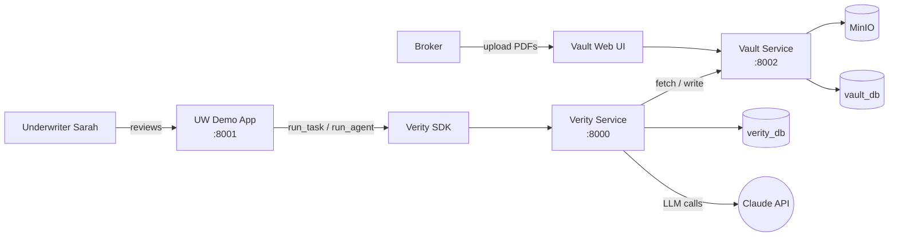
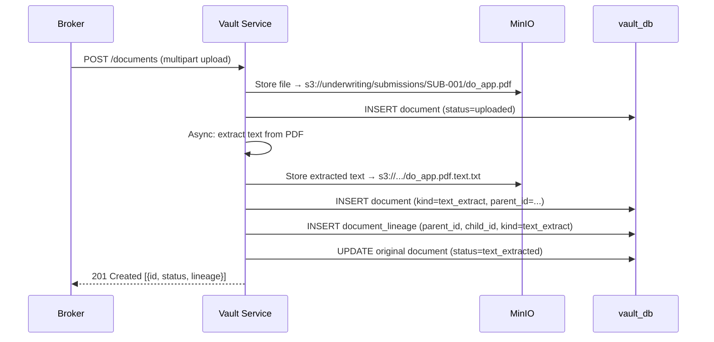
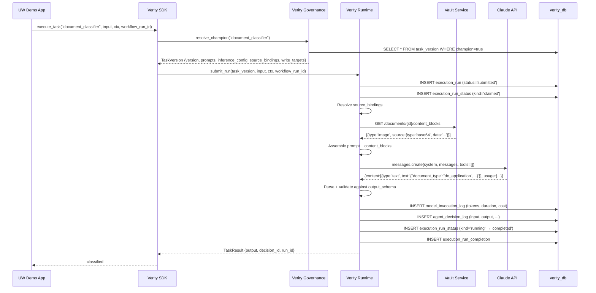
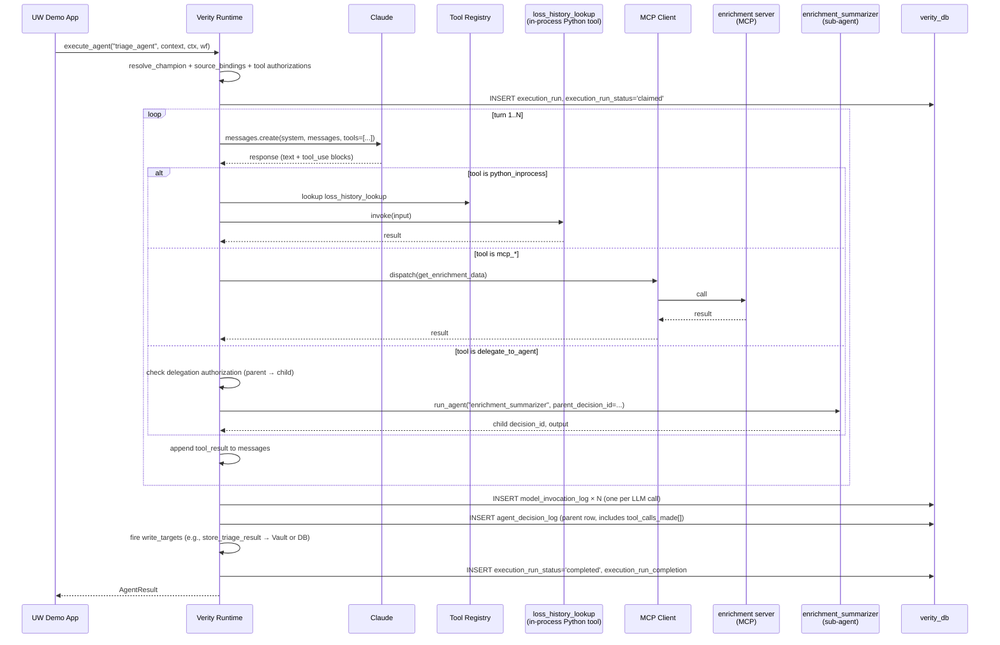

# End-to-End Example — A D&O Submission, From Broker Upload to Regulator Audit

This walkthrough follows one Directors & Officers (D&O) liability submission through the full Verity-governed pipeline. Each phase shows:

- **Control flow** — what the application code does, in pseudocode
- **Data flow** — what crosses each service boundary
- **Data contracts** — exact JSON shapes
- **Statuses** — state transitions on every long-lived row
- **What gets written** — the rows that land in `verity_db` and `vault_db` for audit

By the end you will see exactly how a single submission produces a complete, queryable audit trail — and how a regulator request six months later is answered with one query.

---

## Cast of characters

| Actor | Role |
|---|---|
| **Acme Dynamics broker** | Uploads the submission documents to Vault |
| **Underwriter (Sarah)** | Reviews AI output, can override |
| **`uw_demo` app** | The consuming application that orchestrates workflows |
| **Verity Governance** | Resolves champion versions, reads decision log, gates promotions |
| **Verity Runtime** | Executes Tasks and Agents, fires connectors, writes the audit |
| [**Vault**][vault] | Document store + text extraction + lineage tracking (companion service) |
| **Claude** | The LLM, called via Anthropic SDK by Verity Runtime |

> Hover any underlined term in this document to see a one-line definition; click to read the full glossary entry. New terms get the tooltip on first use; subsequent uses are plain text. Full glossary at [`glossary/`](glossary/README.md).

## Pre-conditions — what's already registered in Verity

By the time the submission arrives, the `uw_demo` [application][application] has already been registered with Verity, and four [governed entities][governed-entity] are live as [champions][champion-resolution]:

| Entity | Kind | Materiality | Purpose |
|---|---|---|---|
| `document_classifier` | [Task][task] | [medium][materiality-tier] | Per-document type classification (D&O app vs loss run vs board resolution) |
| `field_extractor` | Task | high | Extract structured fields from a classified document |
| `triage_agent` | [Agent][agent] | high | Score the submission risk and produce a routing recommendation |
| `appetite_agent` | Agent | high | Determine appetite fit, citing guideline sections |

Each entity has a frozen composition: pinned [prompt versions][prompt-version], an [inference_config][inference-config], declarative [source_binding][source-binding] rows, declarative [write_target][write-target] rows, and (for agents) [authorized tools][tool-authorization] and [sub-agent delegations][sub-agent-delegation]. [Validation runs][validation-run] against [ground truth datasets][ground-truth-dataset] have been recorded against each champion version.

## High-level architecture



---

## Phase 1 — Document Ingestion (Vault)

### What happens

The broker uploads three documents to Vault under the `underwriting` collection, in a folder named for the submission ID:

- `do_app_acme_dynamics.pdf` — the D&O application form
- `loss_run_acme_dynamics.txt` — the loss history
- `board_resolution_acme_dynamics.txt` — the board's authority for the application

### Sequence



### Vault Document data contract

```json
{
  "id": "doc-uuid-1",
  "collection": "underwriting",
  "folder_path": "/submissions/SUB-001",
  "filename": "do_app_acme_dynamics.pdf",
  "content_type": "application/pdf",
  "size_bytes": 482113,
  "tags": {
    "context_type": "submission",
    "context_ref": "submission:SUB-001",
    "lob": "do",
    "named_insured": "Acme Dynamics"
  },
  "status": "text_extracted",
  "lineage_role": "original",
  "uploaded_at": "2026-04-25T10:14:23Z",
  "extracted_text_doc_id": "doc-uuid-1-text"
}
```

### Statuses on the Vault document row

```
uploaded → text_extracted → (later: classified, extracted)
```

`uploaded` lands at the moment the multipart POST completes. `text_extracted` flips when the async extraction task finishes. Subsequent statuses are written by the agents that classify and extract fields.

### What got written

| Table | Rows | Notes |
|---|---|---|
| `vault_db.document` | 6 | 3 originals + 3 text-extract children |
| `vault_db.document_lineage` | 3 | parent → text-extract child mapping |
| MinIO objects | 6 | original PDFs/TXTs + extracted text |

---

## Phase 2 — Document-Processing Workflow (per-document Tasks)

### What happens

Underwriter Sarah opens the submission in the UW Demo app. The app:

1. Creates an [execution_context][execution-context] row in Verity scoped to this submission
2. Generates a fresh [workflow_run_id][workflow-run-id] for the doc-processing workflow
3. Pulls the document index from Vault, filtered to **originals only** (lineage children excluded)
4. Loops the documents, calling `verity.execute_task(...)` per document — first to classify, then (for D&O application docs) to extract fields

### Control flow (app code)

```python
import uuid
from verity import VerityClient
from vault_client import VaultClient

verity = VerityClient(base_url="http://verity:8000")
vault = VaultClient(base_url="http://vault:8002")

# Bind the work to a business operation
ctx = await verity.create_execution_context(
    application="uw_demo",
    context_ref="submission:SUB-001",
    description="D&O submission Acme Dynamics",
)

workflow_run_id = uuid.uuid4()  # one workflow → one correlation id

documents = await vault.list_documents(
    context_ref="submission:SUB-001",
    lineage_role="original",   # NOT text-extract children
)

for doc in documents:
    classified = await verity.execute_task(
        task_name="document_classifier",
        input_data={
            "submission_id": "SUB-001",
            "lob": "do",
            "named_insured": "Acme Dynamics",
            "documents": [{
                "id": doc.id,
                "filename": doc.filename,
                "content_type": doc.content_type,
            }],
        },
        execution_context_id=ctx.id,
        workflow_run_id=workflow_run_id,
    )

    if classified.output["document_type"] == "do_application":
        await verity.execute_task(
            task_name="field_extractor",
            input_data={
                "submission_id": "SUB-001",
                "named_insured": "Acme Dynamics",
                "documents": [{"id": doc.id, "filename": doc.filename}],
            },
            execution_context_id=ctx.id,
            workflow_run_id=workflow_run_id,
        )
```

Notice: **all orchestration is in the app code.** Verity executes one Task per call, returns a result, and writes the audit. The app threads `execution_context_id` and `workflow_run_id` through every call so the audit trail clusters correctly.

> The two SDK entry points are `verity.execute_task` and `verity.execute_agent`. Their async siblings (`submit_task` / `submit_agent`) return a run handle immediately and let an external worker run the unit. See [`development/application-guide.md` § 3](development/application-guide.md#orchestration--invocation) for the full surface.

### Sequence — one `run_task` call



### Data contract — `TaskInput` (what app passes)

```json
{
  "task_name": "document_classifier",
  "input_data": {
    "submission_id": "SUB-001",
    "lob": "do",
    "named_insured": "Acme Dynamics",
    "documents": [
      {"id": "doc-uuid-1", "filename": "do_app_acme_dynamics.pdf", "content_type": "application/pdf"}
    ]
  },
  "execution_context_id": "ctx-uuid-001",
  "workflow_run_id": "wf-uuid-A",
  "step_name": "classify_documents:do_app_acme_dynamics.pdf",
  "channel": "production",
  "write_mode": "auto",
  "mock_mode": false
}
```

> **`channel`** = [Channel][channel]. **`write_mode`** = [Write Mode][write-mode] (auto = channel-gated). **`mock_mode`** is a flag that records whether a [Mock Context](glossary/mock-context.md) was applied; mocking itself is configured via the SDK's `mock=...` parameter, not via this top-level field.

### Data contract — resolved `source_binding` payload

The classifier task has one source binding configured at registration:

```json
{
  "task_version_id": "tv-uuid-classifier-1.2.0",
  "input_field_name": "documents",
  "binding_kind": "content_blocks",
  "reference": "fetch:vault/get_document_content_blocks(input.documents)",
  "maps_to_template_var": null,
  "required": true
}
```

At resolution time, Runtime calls Vault and gets back content blocks suitable for Claude vision input:

```json
{
  "binding": "documents",
  "kind": "content_blocks",
  "fetched_size_bytes": 482113,
  "content_blocks": [
    {"type": "image", "source": {"type": "base64", "media_type": "application/pdf", "data": "<base64...>"}}
  ]
}
```

### Data contract — `TaskOutput`

```json
{
  "task_version_id": "tv-uuid-classifier-1.2.0",
  "execution_run_id": "run-uuid-001",
  "decision_id": "dec-uuid-001",
  "output": {
    "document_type": "do_application",
    "subtype": "filled_application",
    "confidence": 0.97
  },
  "channel": "production",
  "status": "completed",
  "duration_ms": 4318,
  "tokens": {"input": 12450, "output": 87, "cache_read": 11200}
}
```

### Data contract — [`agent_decision_log`][decision-log] row (the audit record)

```json
{
  "id": "dec-uuid-001",
  "entity_type": "task",
  "entity_version_id": "tv-uuid-classifier-1.2.0",
  "prompt_version_ids": ["pv-uuid-classifier-system-1.0", "pv-uuid-classifier-user-1.0"],
  "inference_config_snapshot": {
    "model_id": "claude-sonnet-4-6",
    "temperature": 0.0,
    "max_tokens": 1024
  },
  "channel": "production",
  "mock_mode": false,
  "execution_context_id": "ctx-uuid-001",
  "workflow_run_id": "wf-uuid-A",
  "execution_run_id": "run-uuid-001",
  "parent_decision_id": null,
  "decision_depth": 0,
  "step_name": "classify_documents:do_app_acme_dynamics.pdf",
  "input_summary": "1 document, lob=do, insured=Acme Dynamics",
  "input_json": {
    "submission_id": "SUB-001",
    "documents": [{"id": "doc-uuid-1", "filename": "do_app_acme_dynamics.pdf"}]
  },
  "output_summary": "do_application (confidence 0.97)",
  "output_json": {"document_type": "do_application", "subtype": "filled_application", "confidence": 0.97},
  "source_resolutions": [
    {
      "binding": "documents",
      "kind": "content_blocks",
      "fetch": "vault/get_document_content_blocks",
      "status": "ok",
      "payload_size_bytes": 482113
    }
  ],
  "target_writes": [],
  "model_used": "claude-sonnet-4-6",
  "input_tokens": 12450,
  "output_tokens": 87,
  "duration_ms": 4318,
  "tool_calls_made": [],
  "application": "uw_demo",
  "run_purpose": "production",
  "status": "complete"
}
```

Note: `input_json` carries the **document reference**, not the file content. The actual PDF bytes were fetched at resolution time via the connector and accounted for in `source_resolutions[0].payload_size_bytes`. The audit row stays small; the heavy data is in Vault and re-fetchable.

### Statuses — [`execution_run`][execution-run] lifecycle

```
submitted → claimed → running → completed
                              ↘ failed
                              ↘ released  (heartbeat lost; janitor reclaimed)
```

Each transition is a separate row in `execution_run_status` (event-sourced). The `execution_run_current` view collapses the latest state for UI reads.

### What got written for one classifier call

| Table | Rows |
|---|---|
| `execution_run` | 1 |
| `execution_run_status` | 4 (submitted, claimed, running, completed) |
| `execution_run_completion` | 1 |
| `agent_decision_log` | 1 |
| `model_invocation_log` | 1 |

For the doc-processing workflow over 3 documents (with one D&O app extracted), the totals are:

| Table | Rows | Notes |
|---|---|---|
| `execution_run` | 4 | 3 classify + 1 extract |
| `execution_run_status` | 16 | 4 lifecycle events × 4 runs |
| `execution_run_completion` | 4 | |
| `agent_decision_log` | 4 | |
| `model_invocation_log` | 4 | |
| `vault_db.document` | +1 | extracted-fields JSON written back as a lineage child of the D&O app PDF (via the field_extractor's `write_target`) |

---

## Phase 3 — Risk-Assessment Workflow (multi-Agent + tools + sub-agent delegation)

### What happens

Once fields are extracted and confirmed, the UW app starts a second workflow against the **same execution context** but with a fresh `workflow_run_id`. This workflow runs Agents — Claude with tool use — rather than single-shot Tasks.

### Control flow (app code)

```python
risk_workflow_id = uuid.uuid4()

triage = await verity.execute_agent(
    agent_name="triage_agent",
    context={
        "submission_id": "SUB-001",
        "named_insured": "Acme Dynamics",
        "extracted_fields": extracted_fields,
    },
    execution_context_id=ctx.id,
    workflow_run_id=risk_workflow_id,
)

appetite = await verity.execute_agent(
    agent_name="appetite_agent",
    context={
        "submission_id": "SUB-001",
        "triage_output": triage.output,
    },
    execution_context_id=ctx.id,
    workflow_run_id=risk_workflow_id,
)
```

### Sequence — `triage_agent` with tool use and a sub-agent



### [Tool authorization][tool-authorization] enforcement

Before each tool call, Runtime checks `agent_version_tool` for `(agent_version_id, tool_name)`. If absent, the tool call is rejected and Claude is told the tool is unavailable — the loop continues with Claude correcting itself. The rejection is logged in `tool_calls_made` with `status='rejected'`.

### [Sub-agent delegation][sub-agent-delegation] contract

When the parent agent uses the `delegate_to_agent` meta-tool, Runtime:

1. Generates the child `decision_id` **before** invoking the child (so the parent's audit row can reference it)
2. Checks `agent_version_delegation` for the parent → child authorization
3. Invokes the child with [parent_decision_id][parent-decision] + `decision_depth = parent.depth + 1`
4. The child writes its own `agent_decision_log` row with the parent reference
5. The parent's `tool_calls_made` array includes one entry naming the child decision

### Data contract — agent decision_log row (with tool calls)

```json
{
  "id": "dec-uuid-101",
  "entity_type": "agent",
  "entity_version_id": "av-uuid-triage-2.1.0",
  "prompt_version_ids": ["pv-uuid-triage-system-1.4"],
  "inference_config_snapshot": {"model_id": "claude-sonnet-4-6", "temperature": 0.2, "max_tokens": 4096},
  "channel": "production",
  "execution_context_id": "ctx-uuid-001",
  "workflow_run_id": "wf-uuid-B",
  "execution_run_id": "run-uuid-101",
  "parent_decision_id": null,
  "decision_depth": 0,
  "step_name": "triage",
  "output_json": {
    "risk_score": 65,
    "routing": "senior_underwriter",
    "narrative": "Mid-size tech company...",
    "risk_factors": ["recent IPO", "single director with prior bankruptcy"]
  },
  "tool_calls_made": [
    {"name": "get_submission_context", "input": {"id": "SUB-001"}, "output": {...}, "status": "ok"},
    {"name": "loss_history_lookup", "input": {"insured": "Acme Dynamics"}, "output": {...}, "status": "ok"},
    {"name": "delegate_to_agent",
     "input": {"agent_name": "enrichment_summarizer"},
     "output": {"child_decision_id": "dec-uuid-102", "summary": "..."},
     "status": "ok"}
  ],
  "target_writes": [
    {"target": "store_triage_result", "mode": "write", "mode_reason": "channel=production",
     "status": "ok", "handle": {"vault_doc_id": "doc-uuid-triage-001"}}
  ],
  "model_used": "claude-sonnet-4-6",
  "input_tokens": 18450,
  "output_tokens": 412,
  "duration_ms": 9821,
  "application": "uw_demo",
  "run_purpose": "production",
  "status": "complete"
}
```

The sub-agent's row (`dec-uuid-102`) is its own record with `parent_decision_id="dec-uuid-101"` and `decision_depth=1`. Audit-trail queries reconstruct the tree by following `parent_decision_id`.

### What got written for the risk workflow

| Table | Rows |
|---|---|
| `execution_run` | 2 (triage + appetite) |
| `execution_run_status` | 8 |
| `agent_decision_log` | 3 (triage + 1 sub-agent + appetite) |
| `model_invocation_log` | ~12 (each agent loop calls Claude multiple turns) |
| `vault_db.document` | +2 (triage_result.json, appetite_determination.json) |

---

## Phase 4 — Underwriter Review & Override

Sarah reviews the triage output. She knows context the agent did not — the named insured's CFO recently joined from a competitor that lost a large class action. She [**overrides**][override-log] the triage assessment from `senior_underwriter` to `executive_review`.

### Override data contract

```json
{
  "id": "ovr-uuid-001",
  "decision_id": "dec-uuid-101",
  "entity_type": "agent",
  "entity_version_id": "av-uuid-triage-2.1.0",
  "ai_recommendation": {"routing": "senior_underwriter", "risk_score": 65},
  "human_decision": {"routing": "executive_review", "risk_score_adjustment": "+15"},
  "reason_code": "additional_context_outside_data",
  "rationale": "CFO previously at FailedCo Inc, where class action was filed Q3 2024. Materially raises perceived governance risk.",
  "overridden_by": "Sarah Chen",
  "overridden_by_role": "Senior Underwriter",
  "created_at": "2026-04-25T10:42:11Z"
}
```

The original AI decision row is **not** modified — it stays as-is with the AI's recommendation. The override is a separate linked record. Both surface in the audit trail.

---

## Phase 5 — The Audit Query (Six Months Later)

A market conduct examiner asks: *"Show me how submission SUB-001 was processed, including any AI involvement."*

### One query, full picture

```sql
WITH context AS (
  SELECT id FROM execution_context
  WHERE application_id = (SELECT id FROM application WHERE name='uw_demo')
    AND context_ref = 'submission:SUB-001'
)
SELECT
  d.id, d.entity_type, d.entity_version_id, d.step_name,
  d.workflow_run_id, d.parent_decision_id, d.decision_depth,
  d.input_summary, d.output_summary, d.tool_calls_made,
  d.model_used, d.input_tokens, d.output_tokens, d.duration_ms,
  d.created_at,
  o.id AS override_id, o.human_decision, o.rationale, o.overridden_by,
  v.version_label
FROM agent_decision_log d
LEFT JOIN override_log o ON o.decision_id = d.id
LEFT JOIN agent_version v ON v.id = d.entity_version_id
   AND d.entity_type = 'agent'
WHERE d.execution_context_id = (SELECT id FROM context)
ORDER BY d.created_at;
```

### What the response contains

For SUB-001:

- **Doc-processing workflow** (workflow_run_id `wf-uuid-A`): 3 classifier rows + 1 extractor row, all clustered by their workflow id
- **Risk workflow** (workflow_run_id `wf-uuid-B`): triage row + enrichment_summarizer sub-agent row + appetite row
- **Override**: 1 row linked to `dec-uuid-101` (triage), with Sarah's reason and rationale
- For each AI row: exact agent/task/prompt versions, frozen inference config, every tool call with inputs and outputs, full message history (re-fetchable), token counts, duration
- **Vault references**: each row's `source_resolutions` and `target_writes` carry Vault doc handles. Re-fetching gives you the exact bytes that fed each call.

### Replay for verification

Any decision can be replayed:

```python
prior = await verity.get_decision("dec-uuid-101")

# Pin the same composition that ran the original
result = await verity.execute_agent(
    agent_name="triage_agent",
    context=prior.input_json,
    mock=MockContext.from_decision_log(prior, mock_llm=False, mock_tools=True),
)
# audit-rerun + reproduced_from linkage are surfaced through the
# replay endpoint; the resulting decision_log row has run_purpose='audit_rerun'
# and reproduced_from_decision_id pointing back at the original.

assert result.output == prior.output_json   # reproducibility check
```

The rerun produces a **new** decision row tagged [`run_purpose='audit_rerun'`][run-purpose] with `reproduced_from_decision_id` pointing at the original. Both rows live forever; the audit can show them side-by-side.

---

## Summary — every row written for one D&O submission

For SUB-001 from upload to override, the database state is:

| Database | Table | Rows | Purpose |
|---|---|---|---|
| `vault_db` | `document` | 9 | 3 originals + 3 text extracts + 1 extracted-fields JSON + 2 agent results (triage, appetite) |
| `vault_db` | `document_lineage` | 6 | parent → child links |
| `verity_db` | `execution_context` | 1 | the submission scope |
| `verity_db` | `execution_run` | 6 | 3 classify + 1 extract + 1 triage + 1 appetite |
| `verity_db` | `execution_run_status` | ~24 | event-sourced lifecycle |
| `verity_db` | `execution_run_completion` | 6 | terminal results |
| `verity_db` | `execution_run_error` | 0 | none failed |
| `verity_db` | `agent_decision_log` | 8 | 4 task decisions + 4 agent decisions (triage + sub-agent + appetite + parent's sub-call) |
| `verity_db` | `model_invocation_log` | ~16 | one row per LLM call (agents loop, tasks single-shot) |
| `verity_db` | `override_log` | 1 | Sarah's triage override |
| `verity_db` | `source_binding` | 0 new | sources are pre-registered; resolutions stored inside `agent_decision_log.source_resolutions` |
| `verity_db` | `write_target` | 0 new | targets pre-registered; writes recorded in `agent_decision_log.target_writes` |

Every numeric value (token counts, durations, costs) is computable on demand. Every dollar attributable to `uw_demo`. Every step rewindable to its exact composition. That is the contemporaneous record SR 11-7, NAIC AI Model Bulletin, and Colorado SB21-169 all expect.

---

## Cross-references

- **Database schema:** [verity/src/verity/db/schema.sql](../verity/src/verity/db/schema.sql)
- **Conceptual model diagram:** [diagrams/verity_db_conceptual_model.svg](diagrams/verity_db_conceptual_model.svg)
- **Execution architecture (full Task / Agent contracts):** [architecture/execution.md](architecture/execution.md)
- **Decision logging levels:** [architecture/decision-logging.md](architecture/decision-logging.md)
- **Technical design (every component in depth):** [architecture/technical-design.md](architecture/technical-design.md)
- **Application developer guide (how to build apps like UW Demo):** [development/application-guide.md](development/application-guide.md)
- **Vault — the document side app:** [apps/vault.md](apps/vault.md)
- **Product vision (the why):** [vision.md](vision.md)


<!-- ─────────────────────── Glossary references ─────────────────────────────── -->
<!-- Hover linked terms above for tooltips; click to read the full glossary entry.       -->
[agent]: glossary/agent.md "Multi-turn agentic loop with tool use and (optionally) sub-agent delegation. Authorized tools per version."
[application]: glossary/application.md "Consuming business app registered with Verity; every entity and decision is scoped/attributed to one or more applications."
[champion-resolution]: glossary/champion-resolution.md "The lookup mechanism by which Verity selects which entity version to run. Default: returns the current champion."
[channel]: glossary/channel.md "Per-call hint (production / staging / shadow / challenger / champion / validation) that drives default write behavior."
[decision-log]: glossary/decision-log.md "One immutable row per AI invocation in agent_decision_log capturing prompts, config, I/O, tool calls, tokens, durations."
[execution-context]: glossary/execution-context.md "Business-level grouping registered by the consuming app; opaque to Verity. Scopes runs to a customer-facing operation (e.g. submission)."
[execution-run]: glossary/execution-run.md "Event-sourced record of one Task or Agent invocation; lifecycle events live in execution_run_status."
[governed-entity]: glossary/governed-entity.md "Supertype: anything Verity tracks as a versioned record (Agent, Task, Prompt, Tool, Pipeline)."
[ground-truth-dataset]: glossary/ground-truth-dataset.md "SME-labeled data scoped to one governed entity. Three tables: dataset (metadata), record (input items), annotation (labels)."
[inference-config]: glossary/inference-config.md "Versioned LLM API parameter set: model, temperature, max_tokens, extended_params. Frozen on entity version promotion."
[materiality-tier]: glossary/materiality-tier.md "Per-entity risk tier (low/medium/high) that drives lifecycle gate strictness and validation thresholds."
[override-log]: glossary/override-log.md "Separate immutable record of a human disagreeing with an AI decision; preserves both AI recommendation and human decision."
[parent-decision]: glossary/parent-decision.md "FK on agent_decision_log linking a sub-agent's decision to its parent; decision_depth records the depth in the delegation tree."
[prompt-version]: glossary/prompt-version.md "Versioned prompt template with governance_tier. Pinned to entity versions; immutable after promotion."
[run-purpose]: glossary/run-purpose.md "Reason for an execution: production / test / validation / audit_rerun. Independent of channel."
[source-binding]: glossary/source-binding.md "Declarative input I/O row defining what to fetch and where to put it."
[sub-agent-delegation]: glossary/sub-agent-delegation.md "Built-in delegate_to_agent meta-tool; parent → child relationships authorized via agent_version_delegation."
[task]: glossary/task.md "Single-shot LLM call with input_schema → structured output_schema. No tool loop, no sub-agents."
[tool-authorization]: glossary/tool-authorization.md "Per-agent-version row authorizing one tool. Unauthorized tool calls are rejected and Claude is informed."
[validation-run]: glossary/validation-run.md "Execution of an entity version against every record in a ground-truth dataset; computes aggregate metrics, gates staging→shadow."
[vault]: glossary/vault.md "Companion document service (collections, lineage, tags, text extraction). Independent DB. Verity reaches it via the canonical data_connector."
[workflow-run-id]: glossary/workflow-run-id.md "Caller-supplied UUID threaded through every execute_* call in one workflow so the audit clusters correctly."
[write-mode]: glossary/write-mode.md "Per-call override (auto / log_only / write) for declared target writes; auto = channel-gated default."
[write-target]: glossary/write-target.md "Declarative output I/O row describing where to write the LLM output."
